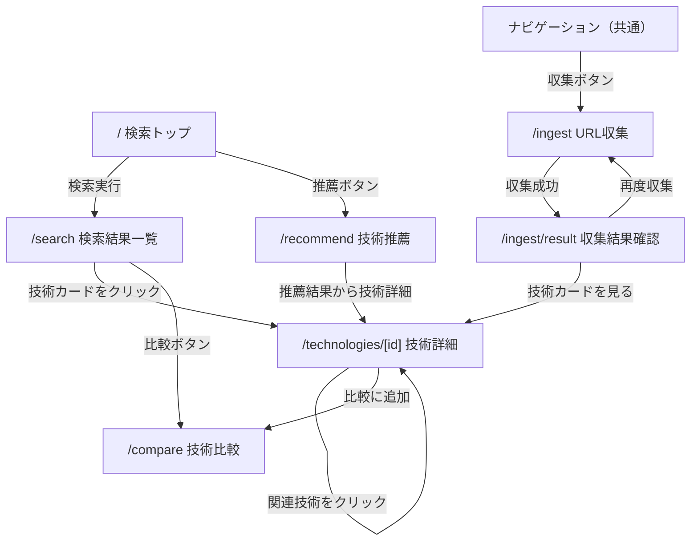

# 画面遷移図 — tech-memory

## 全体遷移

## 画面一覧

| 画面ID | 画面名 | URL | 説明 | 遷移元 | 遷移先 | 認証 |
|---|---|---|---|---|---|---|
| SCR001 | 検索トップ | / | メイン検索画面。技術名・課題・分野で検索できる | - | SCR002, SCR005 | 不要 |
| SCR002 | 検索結果一覧 | /search | 検索結果をカード形式で表示 | SCR001 | SCR003, SCR004 | 不要 |
| SCR003 | 技術詳細 | /technologies/[id] | 技術カードの全情報を表示 | SCR002, SCR006, SCR007 | SCR003（関連技術）, SCR004 | 不要 |
| SCR004 | 技術比較 | /compare | 複数技術のメリット・デメリットを横並び比較 | SCR002, SCR003 | SCR003 | 不要 |
| SCR005 | URL収集 | /ingest | URLを入力して技術カードを自動生成する | ナビ | SCR006 | 不要 |
| SCR006 | 収集結果確認 | /ingest/result | 生成された技術カードをプレビュー確認 | SCR005 | SCR003, SCR005 | 不要 |
| SCR007 | 技術推薦 | /recommend | 課題・制約から技術候補を推薦 | ナビ, SCR001 | SCR003 | 不要 |

## PF別UI方針

### Web（Next.js 15 App Router）

**レスポンシブデザイン:**
- モバイル（< 768px）: シングルカラム、ハンバーガーメニュー
- タブレット（768px - 1024px）: 2カラムカード
- デスクトップ（> 1024px）: 3カラムカード + サイドバー

**ナビゲーション:**
- トップナビバー（固定）に「検索」「収集」「推薦」のリンク
- 画面幅が狭い場合はアイコンのみ表示

**デザイン方針:**
- デスクトップファースト（主要ユースケースはPC作業中の調査）
- shadcn/ui のコンポーネントを基本とする
- ダークモード対応（shadcn/ui デフォルトで対応）

**ローディング・エラー状態:**
- 技術カード一覧: スケルトンローディング
- 収集処理中: プログレスバー + 「30秒程度かかります」メッセージ
- エラー時: shadcn/ui Toast でエラーメッセージ表示
